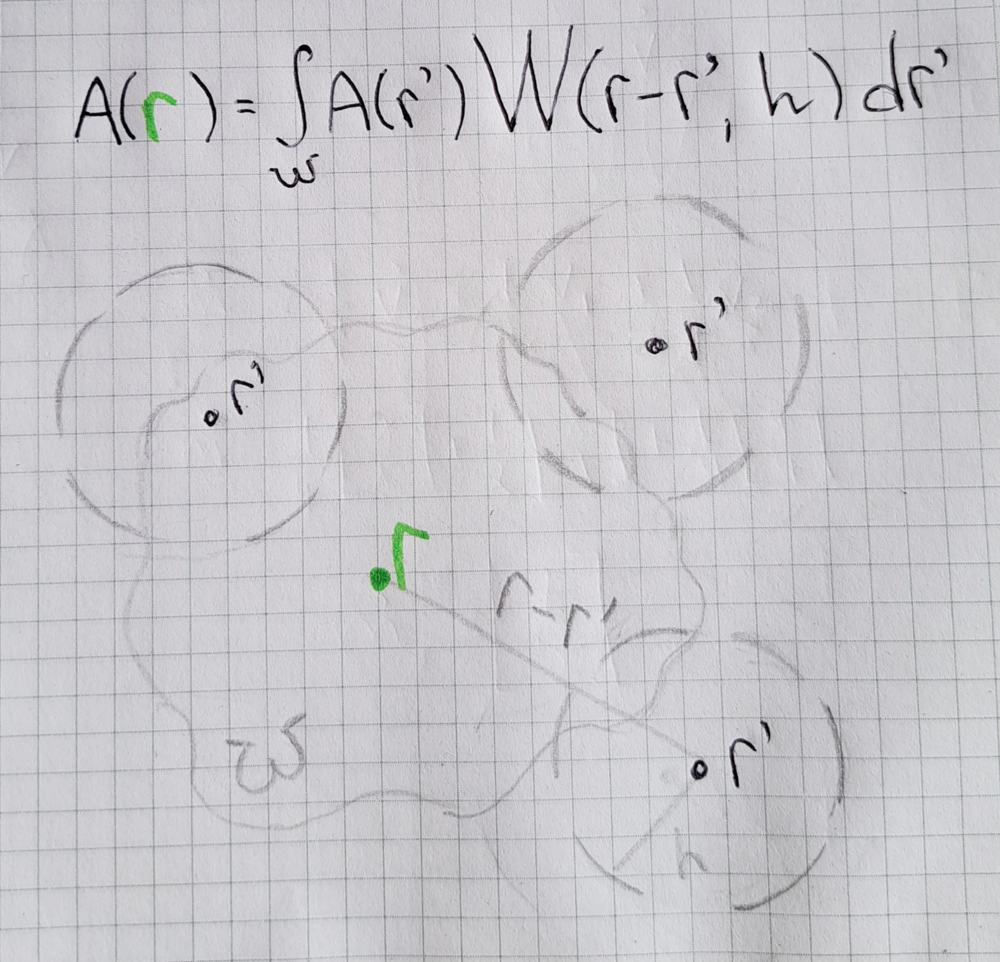

Vulkan Real-Time Fluid Simulation
======================

## Demo

## Introduction

The study of fluid simulation is known as Computational Fluid Dynamics, and the most well-known model for describing the behavior of fluids is given by the Navier-Stokes equations. These equations model a fluid by considering the physical quantities mass-density, pressure, velocity and can be solved using two common approaches: Lagrangian approach (particle-based) and Eulerian approach (grid-based). The project only covers the first one.

The Lagrangian approach involves tracking individual fluid particles as they move about and determining how the fluid properties associated with these particles change as a function of time. The smoothed particle hydrodynamics (SPH) method is based on Lagrangian approach. It is smoothed because it blurs out the boundaries of a particle so that a smooth distribution of physical quantities is obtained. The smoothness in SPH is described using a kernel function.

For the SPH implementation, I relied on papers listed in the Resources section.

## Environment

* Intel Integrated UHD Graphics 620
* Windows 10
* Visual Studio

## SPH interpretation

Since all the math intuition is described in related topics, a visualization I can add is the key idea behind smoothed particle hydrodynamics, which is the integral approximation.

## Boosting FPS

The very first improvement is employing a flat data structure. A data structure is considered flat if its elements are stored together in a contiguous piece of storage. Flat data structures offer an advantage in cache locality, making them more efficient to traverse. The frame rate was less than 30 FPS before and almost 70 FPS after.

Another useful trick is multithreaded rendering. Again, the performance gain is significant. This technique has boosted the FPS value from 70 to 190. I could potentially render twice as many particles if necessary. However, since 5000 vertices is enough to approximate the surface, I would prefer to spend the free computing time for integrating another simulation or adding collision detection.
 
## Resources

The following links may be useful for this project.

* [Particle-Based Fluid Simulation for Interactive Applications](https://matthias-research.github.io/pages/publications/sca03.pdf)
* [Real-Time GPU-based fluid simulation using Vulkan and OpenGL compute shaders](https://github.com/multiprecision/undergraduate_thesis/blob/master/undergraduate_thesis.pdf)
* [CIS565 Vulkan samples](https://github.com/CIS565-Fall-2018/Vulkan-Samples)
* [Official Vulkan documentation](https://www.khronos.org/registry/vulkan/)
